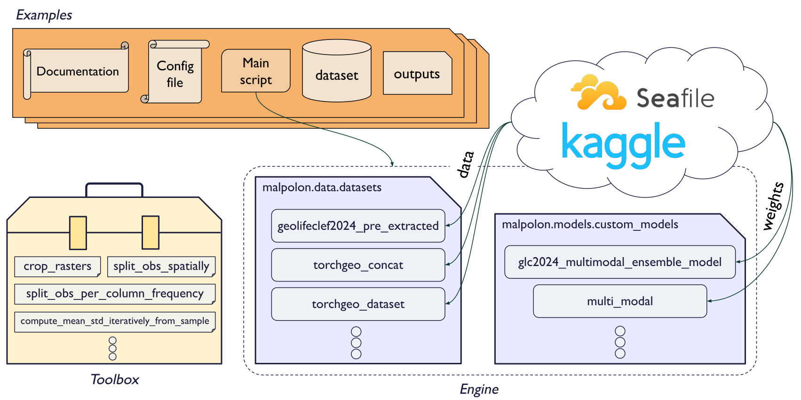

# Getting started with examples
The `benchmark/` directory contains experiments to train a model (or run predictions) on specific datasets (namely GeoLifeCLEF datasets).

The `custom_train/` directory contains dummy examples of custom training scripts that you can re-use to train a model on your own dataset.

The `inference/` directory contains expriments linking to existing trained models to run predictions on GeoLifeCLEF dataset or on your own.

## Architecture
Each examples' main components and their interactions are illustrated in the following diagram:

<div align="center">
  
</div>

Every example contains a main Python script file running the training or prediction of a model.

This script is parametrized by a `.yaml` configuration file; reads the data in a `dataset/` folder; and saves the model's weights, logs, metrics and predictions in an `outputs/` folder.

When ran, the script will call the 3 main components of the Malpolon library:
1. **Dataset**: defines how to read data from your dataset at each iteration
2. **Data Module**: loads and preprocesses the data; makes the bridge between the dataset and the model trainer; holds any data-related hyperparameters _(batch size, number of workers, data transform functions...)_
3. **Model**: defines the neural network architecture; holds any model-related hyperparameters & objects _(loss function, optimizer, metrics, model size...)_

Additionally, a **toolbox** containing useful data pre-processing scripts is available at the project's root.


## Usage (examples)
To run an experiment as is, simply run:

```script
python <SCRIPT_NAME>.py
```

### How to run benchmark examples
<details>
  <summary><i><u>Click here to toggle instructions</u></i></summary>

Benchmark examples are custom tailored experiments we created to showcase the capabilities of Malpolon on specific datasets. They are mostly focused on the GeoLifeClef challenges from years 2022 to 2024.

There is no tuning to do to run these examples. You could even run the same models on your own dataset by exactly following the same data formats, structures and modalities.

</details>


### How to customize and train your example
<details>
  <summary><i><u>Click here to toggle instructions</u></i></summary>
To create a custom example, we recommend you duplicate an example that best fits your use case and follow these steps:

#### 0. Drop your data in `dataset/`

#### 1. Update your configuration file

Update your `.yaml` config file in the `config/` directory to match your dataset, model and training parameters. In particular, update the **paths** to your data and observation files, your **number of classes**, your training **task**, your **model selection**, and your **metrics**.

---

💡 To list all the models available from `timm`, open a terminal and run:

```python
import timm
timm.list_models()
```
For `torchvision` head over to: https://pytorch.org/vision/0.17/models.html

---

#### 2. Create a dataset class

If your dataset structure or data format is not supported by any of the existing `Dataset` classes, you will need to write your own, inheriting at least our base class `malpolon.data.data_module.BaseDataModule`.

See `malpolon.data.datasets` for examples.

#### 3. Update your data module

In your script file, update your `DataModule` class to use the correct dataset class by re-defining the `get_dataset()` method.

Here is an example of a custom `DataModule` class inheriting `RasterGeoDataModule` before the `main` function:

<details open>
  <summary><i><u>Click here to toggle instructions</u></i></summary>

```python
class CustomDataModule(RasterGeoDataModule):
    def get_dataset(self, split, transform, **kwargs):
        dataset = CustomDataset(
            self.dataset_path,
            labels_name=self.labels_name,
            split=split,
            task=self.task,
            binary_positive_classes=self.binary_positive_classes,
            transform=transform,
            **self.dataset_kwargs
        )
        return dataset
```
</details>

If you need to customize your class input parameters or to redefine the initialization method, you can do so by overriding the `__init__` method.

<details>
  <summary><i><u>Click here to toggle instructions</u></i></summary>

```python
class CustomDataModule(RasterGeoDataModule):
   def __init__(
        self,
        dataset_path: str,
        labels_name: str = 'labels.csv',
        train_batch_size: int = 32,
        inference_batch_size: int = 16,
        num_workers: int = 8,
        size: int = 200,
        units: str = 'pixel',
        crs: int = 4326,
        binary_positive_classes: list = [],
        task: str = 'classification_multiclass',
        dataset_kwargs: dict = {},
        **kwargs,
    ):
        """Class constructor."""
        super().__init__(dataset_path, labels_name, train_batch_size, inference_batch_size, num_workers, size, units, crs, binary_positive_classes, task, dataset_kwargs, **kwargs)


    def get_dataset(self, split, transform, **kwargs):
        dataset = CustomDataset(
            self.dataset_path,
            labels_name=self.labels_name,
            split=split,
            task=self.task,
            binary_positive_classes=self.binary_positive_classes,
            transform=transform,
            **self.dataset_kwargs
        )
        return dataset
```
</details>


Additionally, you can update the `train_transform` and `test_transform` properties to use your custom data transforms.

<details>
  <summary><i><u>Click here to toggle instructions</u></i></summary>

```python
class CustomDataModule(RasterGeoDataModule):
   def __init__(
        self,
        dataset_path: str,
        labels_name: str = 'labels.csv',
        train_batch_size: int = 32,
        inference_batch_size: int = 16,
        num_workers: int = 8,
        size: int = 200,
        units: str = 'pixel',
        crs: int = 4326,
        binary_positive_classes: list = [],
        task: str = 'classification_multiclass',
        dataset_kwargs: dict = {},
        **kwargs,
    ):
        """Class constructor."""
        super().__init__(dataset_path, labels_name, train_batch_size, inference_batch_size, num_workers, size, units, crs, binary_positive_classes, task, dataset_kwargs, **kwargs)


    def get_dataset(self, split, transform, **kwargs):
        dataset = CustomDataset(
            self.dataset_path,
            labels_name=self.labels_name,
            split=split,
            task=self.task,
            binary_positive_classes=self.binary_positive_classes,
            transform=transform,
            **self.dataset_kwargs
        )
        return dataset

    @property
    def train_transform(self):
        return transforms.Compose(
            [
                transforms.RandomRotation(degrees=45, fill=1),
                transforms.Normalize(
                    mean=[0.485, 0.456, 0.406, 0.2],
                    std=[0.229, 0.224, 0.225, 0.2]
                ),
            ]
        )
```
</details>

#### 4. Call your custom data module

In your script `main` function, update the line instanciating your datamodule to use your custom class:

```python
# Datamodule & Model
datamodule = CustomDataModule(**cfg.data, **cfg.task)
```

#### 5. Look at your results

Your model weights, logs, metrics and predictions will be saved in the `outputs/<SCRIPT_NAME>/<DATE>/` folder.

**Weights** are stored in a PyTorch checkpoint file either named `last.ckpt` or `pretrained.ckpt`.

**Metrics** are saved in a `metrics.csv` file. Additionally, by default they are logged in a TensorBoard file which you can view by running the following command in a terminal:
```script
tensorboard --logdir tensorboard_logs/
```
and then `ctrl+click` on the `localhost` link that appears in the terminal.

Your **parameters** for this run are stored in a `hparams.yaml` file.

**Logs** are saved in a `<SCRIPT_NAME>.log` file.

</details>

### How to run predictions (inference) ?
<details>
  <summary><i><u>Click here to toggle instructions</u></i></summary>

There are 2 ways to run predictions on your mmodel.

1. **The recommended way**

- Create a new directory under `examples/inference/` containing your example script.
- Create symbolic links to your dataset and training outputs (Linux/Mac command lines):
  - `ln -s ../../custom_train/<EXAMPLE_NAME>/dataset/ dataset`
  - `ln -s ../../custom_train/<EXAMPLE_NAME>/outputs/ outputs_training`
- Copy your config file and:
  - Change the key `run.predict` to `run.predict_type` with either `test_dataset` or `test_point` as value.
  - Update the value of `run.checkpoint_path` to `outputs_training/<SCRIPT_NAME>/<DATE>/last.ckpt`.

Then run your script as usual.

1. **The manual way**

For a quick test, you can also:

- Update the `run.predict` key in your config file to `false`.
- Update the value of `run.checkpoint_path` to `outputs/<SCRIPT_NAME>/<DATE>/last.ckpt`.
- Comment in your script the inference part you don't need (test dataset or data point)
- Find your inference outputs in the newest `outputs/<SCRIPT_NAME>/<DATE>/` folder and merge them with your training outputs folder.

</details>


## Parameters configuration (config files)

Each example contains a `.yaml` configuration file in the `config/` directory which is called by the main function of the experiment's script. All hyperparameters are specified in this configuration file, which is transformed into a dictionary by the [**Hydra**](https://hydra.cc/docs/intro/) library.

You can parametrize your models and your training routine through your `.yaml` config file which is split in main sections:

- **run**: parameters related to prediction and transfer learning\
  This section is passed on to your PyTorchLightning checkpoint loading method.
- **data**: data related information such as the path to your dataset or batch size.\
  This section is passed on to your data module _(e.g. `Sentinel2TorchGeoDataModule`)_.
- **task**: defines the type of deep learning task chosen for your experiment (currently only supporting any of `['classification_binary', 'classification_multiclass', 'classification_multilabel']`)\
  This section is passed on to your prediction system _(e.g. `ClassificationSystem`)_. If 'multiclass' is chosen, the **loss** will be set to `CrossEntropyLoss`; otherwise it will be `BCEWithLogitsLoss`.
- **trainer**: parameters to tweak your training session via PyTorchLightning Trainer class\
  This section is passed on to your PyTorchLightning trainer.
- **model**: defines which model you want to load, from which source, and contains models hyperparameters. You can pass any model hyperparameter listed in your provider's model builder.\
  This section is passed on to your prediction system _(e.g. `ClassificationSystem`)_.
- **optim**: your loss parameters optimizer, scheduler and metrics hyperparameters.\
  This section is passed on to your prediction system _(e.g. `ClassificationSystem`)_.

Hereafter is a detailed list of every sub parameters (<a style="color:DodgerBlue;">blue entries are dataset-specific</a>):

<details>
  <summary><i><u>Click here to expand sub parameters</u></i></summary>

- **run**
  - **predict** _(bool)_: If set to `true`, runs your example in inference mode; if set to `false`, runs your example in training mode.
  - **checkpoint\_path** _(str)_: Path to the PyTorch checkpoint you wish to load weights from, for prediction, resuming training or performing transfer learning.

- **data**
  - **num_classes** _(int)_: Number of classes for your classification task.
  - **dataset\_path** _(str)_: path to the dataset (details about how to structure your data in examples Readmes).
  - **labels\_name** _(str)_: name of the file containing the labels which should be located in `dataset_path`
  - **train\_batch\_size** _(int)_: size of train batches.
  - **inference\_batch\_size** _(int)_: size of inference batches.
  - **num\_workers** _(int)_: number of worker processes to use for loading the data. When you set the “number of workers” parameter to a value greater than 0, the DataLoader will load data in parallel using multiple worker processes.
  - **<a style="color:DodgerBlue;">units</a>** _(str)_: unit system of the queries performed on the dataset. This value should be equal to your observations' coords units (which can be different from your dataset's unit system). Takes any value in [`'crs'`, `'pixel'`, `'meter'`] as input.
  - **<a style="color:DodgerBlue;">crs</a>** _(int)_: coordinate reference system of the queries performed on the dataset. This value should be equal to the CRS of your observations, which can be different from your dataset's CRS.
  - **<a style="color:DodgerBlue;">download\_data\_sample</a>** _(bool)_: If `true`, a small sample of the example's dataset will be downloaded (if not already on your machine)
  - **<a style="color:DodgerBlue;">dataset_kwargs</a>**\
    Parameters forwarded to the dataset constructor. You may add any parameter in this section belonging to your dataset's constructor. Leave empty (None) to use the dataset's default parameter value.\
    In this example, the dataset is a concatenation of two datasets: the `RasterBioclim` and the `PatchesDataset`, passed as a list of dictionaries.
    - **item n°k**
      - **callable** _(str)_: String containing the name of the class you want to call. Can be any class of `geolifeclef2024`, `torchgeo_datasets` or `torchgeo_sentinel2` modules.
      - **kwargs** _(dict)_: Dictionary containing the parameters you want to pass to your callable class.
    - ...

- **task**
  - **task** _(str)_: deep learning task to be performed. At the moment, can take any value in [`'classification_binary'`, `'classification_multiclass'`, `'classification_multilabel'`]. The task determines what loss function is used (multiclass -> CrossEntropyLoss, BCEWithLogitsLoss otherwise).

- **trainer**
  - **accelerator** _(str)_: Selects the type of hardware you want your example to run on. Takes values in [`'cpu'`, `'gpu'`, `'tpu'`, `'hpu'`, `'ipu'`].
  - **devices** _(int or str)_: Defines how many accelerator devices you want to use for parallelization. Set to `'auto'` to use all available.
  - **max_epochs** _(int)_: The maximum number of training epochs.
  - **val_check_interval** _(int)_: How often within one training epoch to check the validation set. Takes any value in `[0, max_steps_per_epoch]`
  - **check_val_every_n_epoch** _(int)_: Defines the interval of epochs on which validation should be performed throughout training.
  - **log_every_n_steps** _(int)_: How often to log everything within one training step (defaults to 50 if `None`).

- **model**
  - **provider\_name** _(str)_: Defines the source you want to load your models from. Models from the timm and torchvision repositories can be downloaded with or without pre-trained weights and are fully PyTorch compatible. Takes any value in [`'timm'`, `'torchvision'`, `'malpolon'`].
  - **model\_name** _(str)_: Name of the model you wish your provider to retrieve. For a complete list of available models, please refer to [timm's](https://timm.fast.ai/), [torchvision's](https://pytorch.org/vision/stable/models.html) or [Malpolon's custom models](https://plantnet.github.io/malpolon/api.html#malpolon-models-custom-models-glc2024-multimodal-ensemble-model-modality-specific) documentations.
  - **model_kwargs**\
    Parameters forwarded to the model constructor. You may add any parameter in this section belonging to your model's constructor. Leave empty (None) to use the model's default parameter value.
    - **pretrained** _(bool)_: If `true`, your model will be retrieved with pre-trained weights; if `false`, your model will be retrieved with no weights and training will have to be conducted from scratch.
    - **num_classes** _(int)_: Number of classes for you classification task.
    - **in\_chans** _(int)_: Number of input channels.
    - **output\_stride** _(int)_: Output stride value for CNN models. This parameter defines how much the convolution window is shifted when performing convolution.
    - **global\_pool** _(str)_: Type of global pooling. Takes any value in [`'avg'`, `'max'`, `'avgmax'`, `'catavgmax'`].
    - ...
  - **modifiers**\
    Malpolon's modifiers you can call to modify your model's structure or behavior.
    - **change\_first\_convolutional\_layer** (optional)
      - **num\_input\_channels** _(int)_: Number of input channels you would like your model to take instead of its default value.
    - **change_last_layer** (optional)
      - **num\_outputs** _(int)_: Number of output channels you would like your model to have instead of its default value.
    - **change_last_layer_to_identity_modifier** (optional): Replaces the last layer of your model with an identity layer.

- **optim**
  - **loss_kwargs** (optional): any key-value arguments compatible with the selected loss function. See [PyTorch documentation](https://pytorch.org/docs/stable/nn.html#loss-functions) for the complete list of kwargs to your loss function.
    - **pos_weight** (optional) _(float)_: Weight of the positive class in the BCEWithLogitsLoss function.
    - ...
  - **optimizer** (optional): Chose your optimizer here. If no value provided, by default SGD is selected with the following arguments `[lr=1e-2, momentum=0.9, nesterov=True]`
    - **_\<optimizer name\>_** (optional) _(str)_: Name of an optimizer you want to call. Can either be a custom name or one of the keys listed in `malpolon.models.utils.OPTIMIZERS_CALLABLES`
      - **callable** (optional) _(str)_: Name of the optimizer you want to call.
      - **kwargs**: any key-value arguments compatible with the selected optimizer such as `lr` (learning rate). See [PyTorch documentation](https://pytorch.org/docs/stable/optim.html) for the complete list of kwargs to your optimizer. Leave empty (None) to use the optimizer's default parameter value.
        - **lr** (optional): learning rate
        - ...
  - **metrics**
    - **_\<metric name\>_**: The name of your metric. Can either be a custom name or one of the keys listed in `malpolon.models.utils.FMETRICS_CALLABLES`. In the latter case, the _callable_ argument is not required.
      - **callable** (optional) _(str)_: Name of the TorchMetrics functional metric to call _(e.g.: `'torchmetrics.functional.classification.multiclass_accuracy'`)_. Find all functional metrics on the TorchMetrics documentation page such as [here](https://torchmetrics.readthedocs.io/en/stable/classification/accuracy.html#functional-interface) in the "functional Interface" section. Learn more about functional metrics [here](https://lightning.ai/docs/torchmetrics/stable/pages/quickstart.html#functional-metrics).
      - **_kwargs_**: any key-value arguments compatible with the selected metric such as `num_classes` or `threshold`. See [TorchMetrics documentation](https://lightning.ai/docs/torchmetrics/stable/all-metrics.html) for the complete list of kwargs to your metric.
        - **num_classes**: Number of classes for your multiclass classification task.
        - **num_labels**: Number of labels for your multilabel classification task.
        - **threshold** (optional): Threshold value for your metric.
        - ...

</details>

## ⚒️ Troubleshooting
### `ValueError: Expected more than 1 value per channel when training, got input size torch.Size([1, 256, 1, 1])`

This error might occur when your model is trying to perform a forward pass on a layer which encounters division by 0 because of how small the data is.

Typically, a ResNet block cannot run a `batch_norm` operation on a tensor of size `[1, 256, 1, 1]` because for each of the 256 channels, there is only 1 value to normalize. Since the operation is `value - mean / std`, the std is 0 and the operation is impossible.

To solve this issue, you can either:
- **Increase the batch size** of your dataloader. A small batch size can lead to the last one containing only 1 element _e.g.: a dataset of 99 elements with batch size of 2. Increasing the batch size to 4 would leave a remainder of 3 elements in the last batch [3, 256, 1, 1]_.
- **Increase the input size of your data** so that the encoding layers don't reduce the size too much _e.g.: a patch size of 64 leads to [1, 256, 4, 4]_
- **Change the model architecture** by removing the `batch_norm` layers (can lead to further issues).