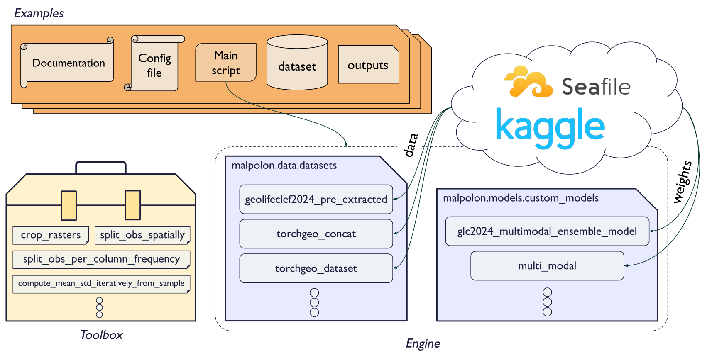

# Custom train examples
This directory contains dummy examples of custom training scripts that you can re-use to train a model on your own dataset.

## Architecture
Each examples' main components and their interactions are illustrated in the following diagram:

<div align="center">
  
</div>

Every example contains a main Python script file running the training or prediction of a model.

This script is parametrized by a `.yaml` configuration file; reads the data in a `dataset/` folder; and saves the model's weights, logs, metrics and predictions in an `outputs/` folder.

When ran, the script will call the 3 main components of the Malpolon library:
1. **Dataset**: defines how to read data from your dataset at each iteration
2. **Data Module**: loads and preprocesses the data; makes the bridge between the dataset and the model trainer; holds any data-related hyperparameters _(batch size, number of workers, data transform functions...)_
3. **Model**: defines the neural network architecture; holds any model-related hyperparameters & objects _(loss function, optimizer, metrics, model size...)_

Additionally, a **toolbox** of useful pre-processing scripts is available in the `utils/` directory at the project's root.


## Usage
To run a model as is, simply run:

```script
python <SCRIPT_NAME>.py
```

### How to customize your example
To create a custom example, we recommend you duplicate an example that best fits your use case and follow these steps:

#### 0. Drop your data in `dataset/`

#### 1. Update your configuration file

Update your `.yaml` config file in the `config/` directory to match your dataset, model and training parameters. In particular, update the **paths** to your data and observation files, your **number of classes**, your training **task**, your **model selection**, and your **metrics**.

---

💡 To list all the models available from `timm`, open a terminal and run:

```python
import timm
timm.list_models()
```
or via torchvision head over to: https://pytorch.org/vision/0.17/models.html

---

#### 2. Create a dataset class (optional)

If your dataset structure or data format is not supported by any of the existing `Dataset` classes, you will need to write your own inheriting our base class `malpolon.data.data_module.BaseDataModule`.

See `malpolon.data.datasets` for examples.

#### 3. Update your data module

In your script file, update your `DataModule` class to use the correct dataset class by re-defining the `get_dataset()` method.

Here is an example of a custom `DataModule` class inheriting `RasterGeoDataModule`:

<details open>
  <summary><i><u>Click here to toggle instructions</u></i></summary>

```python
class CustomDataModule(RasterGeoDataModule):
    def get_dataset(self, split, transform, **kwargs):
        dataset = CustomDataset(
            self.dataset_path,
            labels_name=self.labels_name,
            split=split,
            task=self.task,
            binary_positive_classes=self.binary_positive_classes,
            transform=transform,
            **self.dataset_kwargs
        )
        return dataset
```
</details>

If you need to customize your class input parameters or to redefine the initialization method, you can do so by overriding the `__init__` method.

<details>
  <summary><i><u>Click here to toggle instructions</u></i></summary>

```python
class CustomDataModule(RasterGeoDataModule):
   def __init__(
        self,
        dataset_path: str,
        labels_name: str = 'labels.csv',
        train_batch_size: int = 32,
        inference_batch_size: int = 16,
        num_workers: int = 8,
        size: int = 200,
        units: str = 'pixel',
        crs: int = 4326,
        binary_positive_classes: list = [],
        task: str = 'classification_multiclass',
        dataset_kwargs: dict = {},
        **kwargs,
    ):
        """Class constructor."""
        super().__init__(dataset_path, labels_name, train_batch_size, inference_batch_size, num_workers, size, units, crs, binary_positive_classes, task, dataset_kwargs, **kwargs)


    def get_dataset(self, split, transform, **kwargs):
        dataset = CustomDataset(
            self.dataset_path,
            labels_name=self.labels_name,
            split=split,
            task=self.task,
            binary_positive_classes=self.binary_positive_classes,
            transform=transform,
            **self.dataset_kwargs
        )
        return dataset
```
</details>


Additionally, you can update the `train_transform` and `test_transform` properties to use your custom data transforms.

<details>
  <summary><i><u>Click here to toggle instructions</u></i></summary>

```python
class CustomDataModule(RasterGeoDataModule):
   def __init__(
        self,
        dataset_path: str,
        labels_name: str = 'labels.csv',
        train_batch_size: int = 32,
        inference_batch_size: int = 16,
        num_workers: int = 8,
        size: int = 200,
        units: str = 'pixel',
        crs: int = 4326,
        binary_positive_classes: list = [],
        task: str = 'classification_multiclass',
        dataset_kwargs: dict = {},
        **kwargs,
    ):
        """Class constructor."""
        super().__init__(dataset_path, labels_name, train_batch_size, inference_batch_size, num_workers, size, units, crs, binary_positive_classes, task, dataset_kwargs, **kwargs)


    def get_dataset(self, split, transform, **kwargs):
        dataset = CustomDataset(
            self.dataset_path,
            labels_name=self.labels_name,
            split=split,
            task=self.task,
            binary_positive_classes=self.binary_positive_classes,
            transform=transform,
            **self.dataset_kwargs
        )
        return dataset

    @property
    def train_transform(self):
        return transforms.Compose(
            [
                transforms.RandomRotation(degrees=45, fill=1),
                transforms.Normalize(
                    mean=[0.485, 0.456, 0.406, 0.2],
                    std=[0.229, 0.224, 0.225, 0.2]
                ),
            ]
        )
```
</details>

#### 4. Call your custom data module

In your script, update the line instanciating your datamodule to use your custom class:

```python
# Datamodule & Model
datamodule = CustomDataModule(**cfg.data, **cfg.task)
```