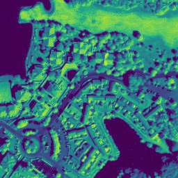
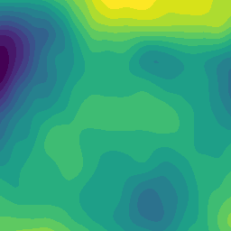
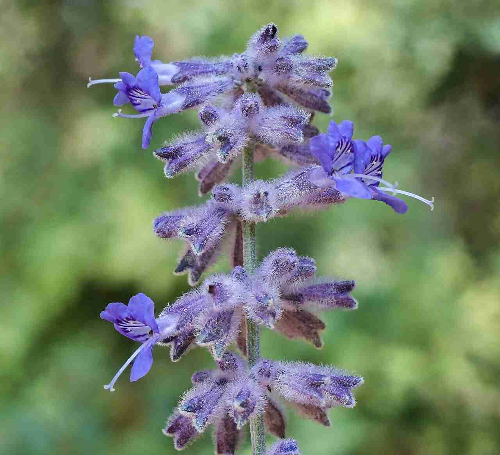
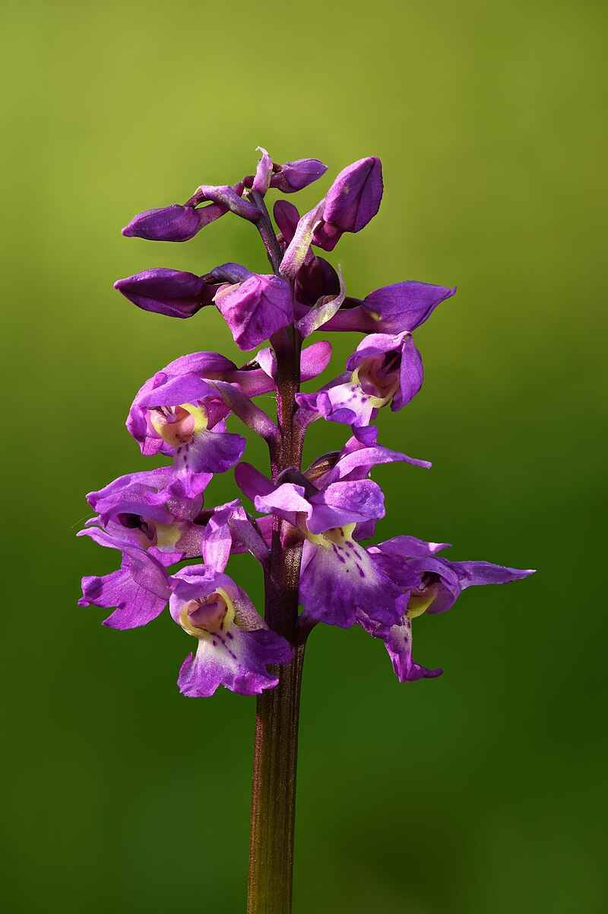

<a name="readme-top"></a>

# MicroGeoLifeCLEF (inference)

This example performs multi-class species prediction using a CNN model on the MicroGeoLifeCLEF 2022 dataset which is a subset of the [GeoLifeCLEF 2022 dataset](https://www.kaggle.com/competitions/geolifeclef-2022-lifeclef-2022-fgvc9) containing RGB-IR satellite data and environmental rasters.

The complete dataset is hosted on Kaggle (cf. link above) while the subset used in this example is hosted by Pl@ntNet.

## Data
### Sample data

The sample data is downloaded automatically when running the example with the default config file, but you can also manually download it [here](https://lab.plantnet.org/seafile/f/b07039ce11f44072a548/?dl=1).

It consists of:

- **Satellite images**: pre-extracted patches of RGB-IR remote sensing images centered at each observation.

    Format: 256x256 JPEG images, a color JPEG file for RGB data and a grayscale one for near-infrared
    Resolution: 1 meter per pixel
    Source: NAIP for US and IGN for France

<div align="center">
  <figure>
      </a>
      <br/>
     <figcaption>IGN Near Infra-Red patch (id 10000660)</figcaption>
  </figure>
</div>

- **Environmental rasters**: pre-extracted patches of high-resolution rasters centered at each observation and full low-resolution rasters
  - Land cover data: patches centered at each observation
    - _Format_: 256x256 TIFF files with Deflate compression
    - _Resolution_: 1 meter per pixel
    - _Source_: NLCD for US and Cesbio for France
  - Altitude data: patches centered at each observation
    - _Format_: 256x256 TIFF files with Deflate compression
    - _Resolution_: 1 meter per pixel
    - _Source_: SRTMGL1 for US and France
  - Bioclimatic data: 19 low-resolution rasters
    - _Format_: GeoTIFF files with LZW compression
    - _Resolution_: 30 arcsec per pixel (~ 1 kilometer per pixel)
    - _Source_: WorldClim for US and France
  - Pedologic data: 8 low-resolution rasters
    - _Format_: GeoTIFF files with LZW compression
    - _Resolution_: 250 meters per pixel
    - _Source_: SoilGrids for US and France


<div align="center">
  <figure>
      </a>
      </a>
      <br/>
     <figcaption>STRMGL1 Altitude (left) and Cesbio Land cover (right) patches (id 10000660)</figcaption>
  </figure>
</div>

- **Observations**

The sample data consists of a subset CSV file of 10,000 observations from the GeoLifeCLEF 2022 dataset. The CSV file contains the following columns:

- `observation_id`: unique identifier of the observation
- `species_id`: unique identifier of the plant species
- `GBIF_species_name`: GBIF species name
- `GBIF_species_id`: GBIF species identifier
- `latitude`: latitude of the observation
- `longitude`: longitude of the observation
- `subset`: subset of the observation (`train`, `val` or `test`)

All observations are located in France and consist of the 10 most present species in the original dataset, belonging to two families (_Lamiaceae_ and _Orchidaceae_):

<div style="text-align: center;">
  <h2>Lamiaceae</h2>
</div>

| Species | Himantoglossum robertianum | Melittis melissophyllum | Orchis mascula | Perovskia atriplicifolia (Salvia yangii) | Vitex agnus-castus |
|:-:|:-:|:-:|:-:|:-:|:-:|
| Photo | |  |  |  |  |
| Source |[Wikipedia: Mentha suaveolens](https://en.wikipedia.org/wiki/Mentha_suaveolens) | [Wikipedia: Melittis](https://en.wikipedia.org/wiki/Melittis) | [Wikipedia: Stachys byzantina](https://en.wikipedia.org/wiki/Stachys_byzantina) | [Wikipedia: Salvia yangii](https://en.wikipedia.org/wiki/Salvia_yangii) | [Wikipedia: Vitex agnus-castus](https://en.wikipedia.org/wiki/Vitex_agnus-castus) | 
| Author | [Broly0](https://commons.wikimedia.org/wiki/User:Smithh05) <br> (12/05/2009) | [BerndH](https://commons.wikimedia.org/wiki/User:BerndH) <br> (01/06/2003) | [Jean-Pol GRANDMONT](https://commons.wikimedia.org/wiki/User:Jean-Pol_GRANDMONT) <br> (09/06/2010) | [Rationalobserver](https://commons.wikimedia.org/wiki/User:Rationalobserver) <br> (20/08/2015) | [Sten Porse](https://commons.wikimedia.org/wiki/User:Sten) <br> (01/06/2006) |
| License | CC0 | CC BY-SA 3.0 | CC BY-SA 3.0 | CC BY-SA 4.0 | CC BY-SA 3.0 |

<div style="text-align: center;">
  <h2>Orchidaceae</h2>
</div>

| Species | Himantoglossum hircinum | Mentha suaveolens | Ophrys apifera | Orchis purpurea | Stachys byzantina |
|:-:|:-:|:-:|:-:|:-:|:-:|
| Photo | | <br> (09/06/2010) num") | | | |
| Source |[Wikipedia: Himantoglossum hircinum](https://en.wikipedia.org/wiki/Himantoglossum_hircinum) |[Wikipedia: Himantoglossum robertianum](https://en.wikipedia.org/wiki/Himantoglossum_robertianum) |[Wikipedia: Orchis mascula](https://en.wikipedia.org/wiki/Orchis_mascula) |[Wikipedia: Ophrys apifera](https://en.wikipedia.org/wiki/Ophrys_apifera) |[Wikipedia: Orchis purpurea](https://en.wikipedia.org/wiki/Orchis_purpurea) |
| Author | [Jörg Hempel](https://commons.wikimedia.org/wiki/User:LC-de) <br> (24/05/2014) | [Hans Hillewaert](https://commons.wikimedia.org/wiki/User:Biopics) <br> (06/04/2010) | [Ivar Leidus](https://commons.wikimedia.org/wiki/User:Iifar) <br> (24/05/023) | [Orchi](https://commons.wikimedia.org/wiki/User:Orchi) <br> (15/06/2005) | [Francesco Scelsa](https://commons.wikimedia.org/w/index.php?title=User:Francesco_Scelsa&action=edit&redlink=1) <br> (10/05/2020) |
| License | CC BY-SA 3.0 de | CC BY-SA 3.0 | CC BY-SA 4.0 | CC BY-SA 3.0 | CC BY-SA 4.0 |

### Data loading and adding more data

- **Pre-extracted patches**

In this example, satellite RGB-IR as well as Altitude and Landcover patches are directly placed in `path_to_example/dataset/patches`.\
However in the full GeoLifeCLEF2022 observations are split in subfolders in the following fashion : `.../patches/subfolder1/subfolder2` where subfolder 1 and 2 respectively correspond to `78` and `56` for a `patchId` of value `12345678`.

The naming convention is as follows: `<patchId>_<modality>` where `patchId` is an 8-digit integer and `modality` is a value in `[rgb, near_ir, altitude, landcover]`

To extend your patches dataset, add more patches in their correct (sub-)directory

- **Environmental rasters**

Rasters are being stored in their own folder within the `<path_to_example>/dataset/rasters` directory, loaded in memory, then raster patches are extracted and stored in memory for later use.

To extend your rasters dataset of an already existing environmental variable, either replace the existing FR and US rasters with bigger ones, or add new TIF files and re-define `malpolon.data.environmental_raster.Raster.append()` to load more rasters than FR and US.

- **Observations**

In the example, MicroLifeCLEF2022, observations are directly placed in `<path_to_example>/dataset/micro_geolifeclef_observations.csv`.\
However in the full GeoLifeCLEF2022 observations are split in 2 CSV files for FR and US observations placed in `path_to_example/dataset/observations`.

To add more observations with MicroLifeCLEF2022 observations file, simply extend your CSV files with the right inputs.

In the case of the full GeoLifeCLEF2022, either extend the FR or US obs files, or add a new CSV obs file and re-define `malpolon.data.datasets.geolifeclef2022.GeoLifeCLEF2022Dataset._load_observation_data()` to load other obs files than FR and US.

## Usage

Examples are **ready-to-use scripts** that can be executed by a simple Python command. Every data, model and training parameters are specified in a `.yaml` configuration file located in the `config/` directory.

### Training

To train an example's model such as `resnet18` in `cnn_on_rgbnir_torchgeo.py`, run the following command:

```script
python cnn_on_rgbnir_torchgeo.py
```

You can also specify any of your config parameters within your command through arguments such as:

```script
python cnn_on_rgbnir_torchgeo.py data.dataset_path=<DATASET_PATH> trainer.gpus=1
```

Config parameters provided in this example are listed in the [Parameters](#parameters) section.

<p align="right">(<a href="#readme-top">back to top</a>)</p>

### Prediction

This example is configured to run in training mode by default but if you want to re-use it for prediction, follow these steps:

- Change config file parameter `run.predict` to `true` 
- Specify a path to your model checkpoint in parameter `run.checkpoint_path`

Note that any of these parameters can also be passed through command line like shown in the previous section and overrule those of the config file.

<p align="right">(<a href="#readme-top">back to top</a>)</p>

### Parameters

All hyperparameters are specified in a `.yaml` configuration file located in a `config/` directory, which is read and transformed into a dictionary by the [**Hydra**](https://hydra.cc/docs/intro/) library.

You can parametrize your models and your training routine through your `.yaml` config file which is split in main sections :

- **trainer** : parameters to tweak your training session via PyTorchLightning Trainer class\
  This section is passed on to your PyTorchLightning trainer.
- **run** : parameters related to prediction and transfer learning\
  This section is passed on to your PyTorchLightning checkpoint loading method.
- **model** : defines which model you want to load, from which source, and contains models hyperparameters. You can pass any model hyperparameter listed in your provider's model builder.\
  This section is passed on to your prediction system _(e.g. `ClassificationSystem`)_.
- **optimizer** : your optimizer and metrics hyperparameters.\
  This section is passed on to your prediction system _(e.g. `ClassificationSystem`)_.
- **task** : defines the type of deep learning task chosen for your experiment (currently only supporting any of `['classification_binary', 'classification_multiclass', 'classification_multilabel']`)\
  This section is passed on to your prediction system _(e.g. `ClassificationSystem`)_.
- **data** : data related information such as the path to your dataset or batch size.\
  This section is passed on to your data module _(e.g. `Sentinel2TorchGeoDataModule`)_.

Hereafter is a detailed list of every sub parameters :

<details>
  <summary><i><u>Click here to expand sub parameters</u></i></summary>

- **trainer**
  - **accelerator** _(str)_ : Selects the type of hardware you want your example to run on. Either `'gpu'` or `'cpu'`.
  - **devices** _(int)_ : Defines how many accelerator devices you want to use for parallelization.
  - **max_epochs** _(int)_ : The maximum number of training epochs.
  - **check_val_every_n_epoch** _(int)_ : Defines the interval of epochs on which validation should be performed throughout training.
- **run**
  - **predict_type** _(str)_ : Choose the type of data you want to perform prediction on. Takes a value in `['test_dataset', 'test_point']`.
  - **checkpoint\_path** _(str)_ : Path to the PyTorch checkpoint you wish to load weights from either for inference mode, for resuming training or perform transfer learning.
- **model**
  - **provider\_name** _(str)_ : Defines the source you want to load your models from. Models from the timm and torchvision repositories can be downloaded with or without pre-trained weights and are fully PyTorch compatible. Either `'timm'` or `'torchvision'`.
  - **model\_name** _(str)_ : Name of the model you wish your provider to retrieve. For a complete list of available models, please refer to [timm's](https://timm.fast.ai/) and [torchvision's](https://pytorch.org/vision/stable/models.html) documentations.
  - **model_kwargs**\
    Parameters forwarded to the model constructor. You may add any parameter in this section belonging to your model's constructor. Leave empty (None) to use the model's default parameter value.
    - **pretrained** _(bool)_ : If `true`, your model will be retrieved with pre-trained weights; if `false`, your model will be retrieved with no weights and training will have to be conducted from scratch.
    - **num_classes** _(int)_ : Number of classes for you classification task.
    - **in\_chans** _(int)_ : Number of input channels.
    - **output\_stride** _(int)_ : Output stride value for CNN models. This parameter defines how much the convolution window is shifted when performing convolution.
    - **global\_pool** _(str)_ : Type of global pooling. Takes any value in [`'avg'`, `'max'`, `'avgmax'`, `'catavgmax'`].
    - ...
  - **modifiers**\
    Malpolon's modifiers you can call to modify your model's structure or behavior.
    - **change_last_layer**
      - **num\_outputs** _(int)_ : Number of output channels you would like your model to have instead of its default value.

- **optimizer**
  - **lr** (_float)_ : Learning rate.
  - **weight\_decay** _(float)_ : Model's regularization parameter that penalizes large weights. Takes any floating value in `[0, 1]`.
  - **momentum** _(float)_ : Model's momentum factor which acts on the model's gradient descent by minimizing its oscillations thus accelerating the convergence and avoiding being trapped in local minimas. Takes ano floating value in `[0, 1]`.
  - **nesterov** _(bool)_ : If `true`, adopts nesterov momentum; if `false`, adopts PyTorch's default strategy.
  - **metrics**
    - **_\<metric name\>_** : The name of your metric. Can either be a custom name or one of the keys listed in `malpolon.models.utils.FMETRICS_CALLABLES`. In the latter case, the _callable_ argument is not required.
      - **callable** (optional) _(str)_ : Name of the TorchMetrics functional metric to call _(e.g.: `'torchmetrics.functional.classification.multiclass_accuracy'`)_. Find all functional metrics on the TorchMetrics documentation page such as [here](https://torchmetrics.readthedocs.io/en/stable/classification/accuracy.html#functional-interface) in the "functional Interface" section. Learn more about functional metrics [here](https://lightning.ai/docs/torchmetrics/stable/pages/quickstart.html#functional-metrics). Takes a string as input.
      - **_kwargs_** (optional) : any key-value arguments compatible with the selected metric such as `num_classes` or `threshold`. See [TorchMetrics documentation](https://lightning.ai/docs/torchmetrics/stable/all-metrics.html) for the complete list of kwargs to your metric.

- **task**
  - **task** _(str)_ : deep learning task to be performed. At the moment, can take any value in [`'classification_binary'`, `'classification_multiclass'`, `'classification_multilabel'`].

- **data**
  - **dataset\_path** _(str)_ : path to the dataset. At the moment, patches and rasters should be directly put in this directory.
  - **train\_batch\_size** _(int)_ : size of train batches.
  - **inference\_batch\_size** _(int)_ : size of inference batches.
  - **num\_workers** _(int)_ : number of worker processes to use for loading the data. When you set the “number of workers” parameter to a value greater than 0, the DataLoader will load data in parallel using multiple worker processes.

</details>

<p align="right">(<a href="#readme-top">back to top</a>)</p>

### Transfer learning

- **Resuming training (same model)**

To resume a training or perform transfer learning with the same model without changing its channels, update your configuration file checkpoint path, and run your script in training mode:

```yaml
run:
  predict: false
  checkpoint_path: <PATH_TO_CHECKPOINT>
```

A new output folder will be generated.

- **Transfer with model modifications**

Be aware that for now there are no tools provided to easily freeze or manage intermediate layers during training. Thus you may encounter challenges when trying to train a model with pre-trained weights _(e.g. from ImageNet)_ on 4-channels (or more) data like RGB-IR as most of the pre-trained models are done over 3-channels RGB images.

However, Malpolon provides methods to modify your **first** and **last** model layers. These methods are located in `malpolon.models.model_builder.py`:

- `change_first_convolutional_layer_modifier()`
- `change_last_layer_modifier()`
- `change_last_layer_to_identity_modifier()`

Furthermore to perform transfer learning with model modifications you can :
- Train from scratch by setting config hyperparameter `model.model_kwargs.pretrained` to false
- Manually change your model and use a freeze strategy before `trainer.fit` (in your main script) to only train 3 bands at once
- Restrain your trainings to 3 bands and merge several output features

Future updates will aim at making this step easier.

<p align="right">(<a href="#readme-top">back to top</a>)</p>

## Additional notes
### Debugging

For debugging purposes, using the `trainer.fast_dev_run=true` and `hydra.job.name=test` parameters can be handy:

```bash
python cnn_on_rgb_patches.py data.dataset_path=<DATASET_PATH> trainer.gpus=1 +trainer.fast_dev_run=true +hydra.job.name=test
```

<p align="right">(<a href="#readme-top">back to top</a>)</p>