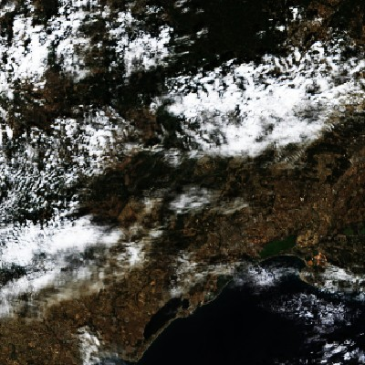
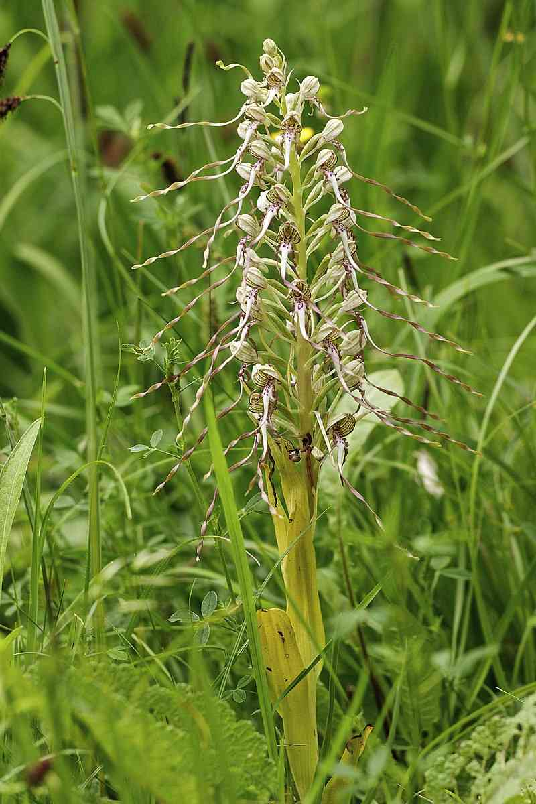
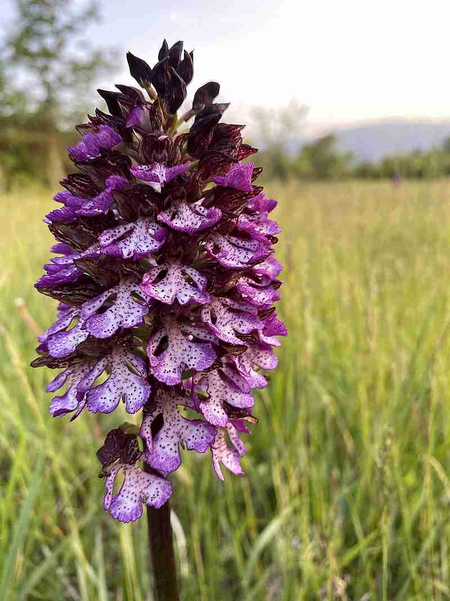

<a name="readme-top"></a>

# Sentinel-2 Raster (using torchgeo) example

This `torchgeo` based example performs multi-class species prediction using a CNN model on Sentinel-2A raster data and geolocated plant observations.

Sentinel-2A satellite data is hosted and available on [Microsoft Planetary Computer](https://planetarycomputer.microsoft.com/dataset/sentinel-2-l2a) (MPC).\
By default, sample data is downloaded from MPC, consisting of 1 tile, 4 bands (RGB-IR).

## Data
### Sample data

The sample data used in this example consists of:
- **Satellite images**: the RGB-IR bands of the tile `T31TEJ` from the Sentinel-2A satellite (which contains the city of Montpellier, France). Each band is a GeoTIFF file with a resolution of 10m.

<div align="center">
  <figure>
    <a href="https://planetarycomputer.microsoft.com/explore?c=4.0129%2C43.6370&z=10.30&v=2&d=sentinel-2-l2a&m=cql%3A17367ba270405507e8f9aa7772327681&r=Natural+color&s=false%3A%3A100%3A%3Atrue&sr=desc&ae=0">
      </a>
      <br/>
     <figcaption>Sentinel-2A tile <code>T31TEJ</code> at 01/08/2019 (dd/mm/yy)</figcaption>
  </figure>
</div>

- **Observations**: a CSV file containing a list of geolocated plant observations from the [Pl@ntNet](https://plantnet.org/) database. The CSV file contains the following columns:
  - `observation_id`: unique identifier of the observation
  - `species_id`: unique identifier of the plant species
  - `GBIF_species_name`: GBIF species name
  - `latitude`: latitude of the observation
  - `longitude`: longitude of the observation
  - `subset`: subset of the observation (`train`, `val` or `test`)

  (The CSV is a dummie file based on the Pl@ntNet observation database so species IDs and geographic coordinates do not reflect real observations.)

Species include:

| Species | Himantoglossum hircinum | Mentha suaveolens | Ophrys apifera | Orchis purpurea | Stachys byzantina |
|:-:|:-:|:-:|:-:|:-:|:-:|
| Photo | |  |  |  |  |
| Source |[Wikipedia: Himantoglossum hircinum](https://en.wikipedia.org/wiki/Himantoglossum_hircinum) | [Wikipedia: Mentha suaveolens](https://en.wikipedia.org/wiki/Mentha_suaveolens) | [Wikipedia: Ophrys apifera](https://en.wikipedia.org/wiki/Ophrys_apifera) | [Wikipedia: Orchis purpurea](https://en.wikipedia.org/wiki/Orchis_purpurea) | [Wikipedia: Stachys byzantina](https://en.wikipedia.org/wiki/Stachys_byzantina) | 
| Author | [Jörg Hempel](https://commons.wikimedia.org/wiki/User:LC-de) <br> (24/05/2014) | [Broly0](https://commons.wikimedia.org/wiki/User:Smithh05) <br> (12/05/2009) |  [Orchi](https://commons.wikimedia.org/wiki/User:Orchi) <br> (15/06/2005) | [Francesco Scelsa](https://commons.wikimedia.org/w/index.php?title=User:Francesco_Scelsa&action=edit&redlink=1) <br> (10/05/2020) | [Jean-Pol GRANDMONT](https://commons.wikimedia.org/wiki/User:Jean-Pol_GRANDMONT) <br> (09/06/2010) |
| License | CC BY-SA 3.0 de | CC0 | CC BY-SA 3.0 | CC BY-SA 4.0 | CC BY-SA 3.0 |

<p align="right">(<a href="#readme-top">back to top</a>)</p>

### Data loading and adding more data

- **Satellite images**

The Sentinel-2A tiles are looked for in the `<path_to_example>/dataset` directory and they are loaded based on their standard naming convention, following several rules are set in `malpolon.data.datasets.torchgeo_sentinel2.RasterSentinel2`.

```python 
  filename_glob = "T*_B0*_10m.tif"
  filename_regex = r"T31TEJ_20190801T104031_(?P<band>B0[\d])"
  date_format = "%Y%m%dT%H%M%S"
  is_image = True
  separate_files = True
  all_bands = ["B02", "B03", "B04", "B08"]
  plot_bands = ["B04", "B03", "B02"]
```

- `filename_glob` is the glob pattern used to find the files in the directory.
- `filename_regex` is the regular expression used to extract the band name from the file name. The argument `?P<band>` is used by `torchgeo` to identify the band name based on `all_bands`.
- `date_format` is the date format used to extract the date from the file name.
- `is_image` is a boolean indicating whether the file is an image or not.
- `separate_files` is a boolean indicating whether the bands are stored in separate files or not.
- `all_bands` is the list of all bands available in your dataset.
- `plot_bands` is the list of bands to plot when calling `plot()` on the dataset.

To extend your dataset, simply drop more files in the `<path_to_example>/dataset` directory with the same naming convention, and adapt your rules to select the new bands and/or tiles.

- **Observations**

The observations are loaded from the `<path_to_example>/dataset/observations.csv` file. The name of the file can vary so long as it matches the name specified in the configuration file.

To extend your dataset, simply add more observations to the CSV file.

<p align="right">(<a href="#readme-top">back to top</a>)</p>

## Usage

Examples are **ready-to-use scripts** that can be executed by a simple Python command. Every data, model and training parameters are specified in a `.yaml` configuration file located in the `config/` directory.

### Training

To train an example's model such as `resnet18` in `cnn_on_rgbnir_torchgeo.py`, run the following command:

```script
python cnn_on_rgbnir_torchgeo.py
```

You can also specify any of your config parameters within your command through arguments such as:

```script
python cnn_on_rgbnir_torchgeo.py data.dataset_path=<DATASET_PATH> trainer.gpus=1
```

Config parameters provided in this example are listed in the [Parameters](#parameters) section.

<p align="right">(<a href="#readme-top">back to top</a>)</p>

### Prediction

This example is configured to run in training mode by default but if you want to re-use it for prediction, follow these steps:

- Change config file parameter `run.predict` to `true` 
- Specify a path to your model checkpoint in parameter `run.checkpoint_path`

Note that any of these parameters can also be passed through command line like shown in the previous section and overrule those of the config file.

<p align="right">(<a href="#readme-top">back to top</a>)</p>

### Parameters

All hyperparameters are specified in a `.yaml` configuration file located in a `config/` directory, which is read and transformed into a dictionary by the [**Hydra**](https://hydra.cc/docs/intro/) library.

You can parametrize your models and your training routine through your `.yaml` config file which is split in main sections :

- **trainer** : parameters to tweak your training session via PyTorchLightning Trainer class\
  This section is passed on to your PyTorchLightning trainer.
- **run** : parameters related to prediction and transfer learning\
  This section is passed on to your PyTorchLightning checkpoint loading method.
- **model** : defines which model you want to load, from which source, and contains models hyperparameters. You can pass any model hyperparameter listed in your provider's model builder.\
  This section is passed on to your prediction system _(e.g. `ClassificationSystem`)_.
- **optimizer** : your optimizer and metrics hyperparameters.\
  This section is passed on to your prediction system _(e.g. `ClassificationSystem`)_.
- **task** : defines the type of deep learning task chosen for your experiment (currently only supporting any of `['classification_binary', 'classification_multiclass', 'classification_multilabel']`)\
  This section is passed on to your prediction system _(e.g. `ClassificationSystem`)_.
- **data** : data related information such as the path to your dataset or batch size.\
  This section is passed on to your data module _(e.g. `Sentinel2TorchGeoDataModule`)_.

Hereafter is a detailed list of every sub parameters :

<details>
  <summary><i><u>Click here to expand sub parameters</u></i></summary>

- **trainer**
  - **accelerator** _(str)_ : Selects the type of hardware you want your example to run on. Either `'gpu'` or `'cpu'`.
  - **devices** _(int)_ : Defines how many accelerator devices you want to use for parallelization.
  - **max_epochs** _(int)_ : The maximum number of training epochs.
  - **check_val_every_n_epoch** _(int)_ : Defines the interval of epochs on which validation should be performed throughout training.
- **run**
  - **predict_type** _(str)_ : Choose the type of data you want to perform prediction on. Takes a value in `['test_dataset', 'test_point']`.
  - **checkpoint\_path** _(str)_ : Path to the PyTorch checkpoint you wish to load weights from either for inference mode, for resuming training or perform transfer learning.
- **model**
  - **provider\_name** _(str)_ : Defines the source you want to load your models from. Models from the timm and torchvision repositories can be downloaded with or without pre-trained weights and are fully PyTorch compatible. Either `'timm'` or `'torchvision'`.
  - **model\_name** _(str)_ : Name of the model you wish your provider to retrieve. For a complete list of available models, please refer to [timm's](https://timm.fast.ai/) and [torchvision's](https://pytorch.org/vision/stable/models.html) documentations.
  - **model_kwargs**\
    Parameters forwarded to the model constructor. You may add any parameter in this section belonging to your model's constructor. Leave empty (None) to use the model's default parameter value.
    - **pretrained** _(bool)_ : If `true`, your model will be retrieved with pre-trained weights; if `false`, your model will be retrieved with no weights and training will have to be conducted from scratch.
    - **num_classes** _(int)_ : Number of classes for you classification task.
    - **in\_chans** _(int)_ : Number of input channels.
    - **output\_stride** _(int)_ : Output stride value for CNN models. This parameter defines how much the convolution window is shifted when performing convolution.
    - **global\_pool** _(str)_ : Type of global pooling. Takes any value in [`'avg'`, `'max'`, `'avgmax'`, `'catavgmax'`].
    - ...
  - **modifiers**\
    Malpolon's modifiers you can call to modify your model's structure or behavior.
    - **change\_first\_convolutional\_layer**
      - **num\_input\_channels** _(int)_ : Number of input channels you would like your model to take instead of its default value.
    - **change_last_layer**
      - **num\_outputs** _(int)_ : Number of output channels you would like your model to have instead of its default value.

- **optimizer**
  - **lr** (_float)_ : Learning rate.
  - **weight\_decay** _(float)_ : Model's regularization parameter that penalizes large weights. Takes any floating value in `[0, 1]`.
  - **momentum** _(float)_ : Model's momentum factor which acts on the model's gradient descent by minimizing its oscillations thus accelerating the convergence and avoiding being trapped in local minimas. Takes ano floating value in `[0, 1]`.
  - **nesterov** _(bool)_ : If `true`, adopts nesterov momentum; if `false`, adopts PyTorch's default strategy.
  - **metrics**
    - **_\<metric name\>_** : The name of your metric. Can either be a custom name or one of the keys listed in `malpolon.models.utils.FMETRICS_CALLABLES`. In the latter case, the _callable_ argument is not required.
      - **callable** (optional) _(str)_ : Name of the TorchMetrics functional metric to call _(e.g.: `'torchmetrics.functional.classification.multiclass_accuracy'`)_. Find all functional metrics on the TorchMetrics documentation page such as [here](https://torchmetrics.readthedocs.io/en/stable/classification/accuracy.html#functional-interface) in the "functional Interface" section. Learn more about functional metrics [here](https://lightning.ai/docs/torchmetrics/stable/pages/quickstart.html#functional-metrics). Takes a string as input.
      - **_kwargs_** (optional) : any key-value arguments compatible with the selected metric such as `num_classes` or `threshold`. See [TorchMetrics documentation](https://lightning.ai/docs/torchmetrics/stable/all-metrics.html) for the complete list of kwargs to your metric.

- **task**
  - **task** _(str)_ : deep learning task to be performed. At the moment, can take any value in [`'classification_binary'`, `'classification_multiclass'`, `'classification_multilabel'`].

- **data**
  - **dataset\_path** _(str)_ : path to the dataset. At the moment, patches and rasters should be directly put in this directory.
  - **labels\_name** _(str)_ : name of the file containing the labels which should be located in the same directory as the data.
  - **download\_data\_sample** _(bool)_ : If `true`, a small sample of the example's dataset will be downloaded (if not already on your machine); if `false`, will not.
  - **train\_batch\_size** _(int)_ : size of train batches.
  - **inference\_batch\_size** _(int)_ : size of inference batches.
  - **num\_workers** _(int)_ : number of worker processes to use for loading the data. When you set the “number of workers” parameter to a value greater than 0, the DataLoader will load data in parallel using multiple worker processes.
  - **units** _(str)_ : unit system of the queries performed on the dataset. This value should be equal to the units of your observations, which can be different from you dataset's unit system. Takes any value in [`'crs'`, `'pixel'`, `'m'`, `'meter'`, `'metre'`] as input.
  - **crs** _(int)_ : coordinate reference system of the queries performed on the dataset. This value should be equal to the CRS of your observations, which can be different from your dataset's CRS.

</details>

<p align="right">(<a href="#readme-top">back to top</a>)</p>

### Transfer learning

- **Resuming training (same model)**

To resume a training or perform transfer learning with the same model without changing its channels, update your configuration file checkpoint path, and run your script in training mode:

```yaml
run:
  predict: false
  checkpoint_path: <PATH_TO_CHECKPOINT>
```

A new output folder will be generated.

- **Transfer with model modifications**

Be aware that for now there are no tools provided to easily freeze or manage intermediate layers during training. Thus you may encounter challenges when trying to train a model with pre-trained weights _(e.g. from ImageNet)_ on 4-channels (or more) data like RGB-IR as most of the pre-trained models are done over 3-channels RGB images.

However, Malpolon provides methods to modify your **first** and **last** model layers. These methods are located in `malpolon.models.model_builder.py`:

- `change_first_convolutional_layer_modifier()`
- `change_last_layer_modifier()`
- `change_last_layer_to_identity_modifier()`

Furthermore to perform transfer learning with model modifications you can :
- Train from scratch by setting config hyperparameter `model.model_kwargs.pretrained` to false
- Manually change your model and use a freeze strategy before `trainer.fit` (in your main script) to only train 3 bands at once
- Restrain your trainings to 3 bands and merge several output features

Future updates will aim at making this step easier.

<p align="right">(<a href="#readme-top">back to top</a>)</p>

## Additional notes
### Debugging

For debugging purposes, using the `trainer.fast_dev_run=true` and `hydra.job.name=test` parameters can be handy:

```bash
python cnn_on_rgb_patches.py data.dataset_path=<DATASET_PATH> trainer.gpus=1 +trainer.fast_dev_run=true +hydra.job.name=test
```

Be careful when using any path argument like `data.dataset_path`, hydra will automatically change the current working directory to the path specified in `hydra.run.dir` which is by default `outputs/<hydra_job_name>/<date>` (where `<hydra_job_name>` equals the name of your example file).
Consequently, any path related argument you should be written relatively to `hydra.run.dir` (e.g. `data.dataset_path: ../../../dataset`).

<p align="right">(<a href="#readme-top">back to top</a>)</p>