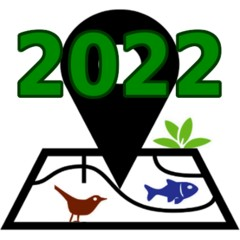

# GeoLifeCLEF 2022

<div align="center">
  <a href="https://www.kaggle.com/competitions/geolifeclef-2022-lifeclef-2022-fgvc9"></a>
</div>

This repository is related to the GeoLifeCLEF challenge.

The details of the challenge, the data, and all other useful information are present on the challenge page: [https://www.kaggle.com/competitions/geolifeclef-2022-lifeclef-2022-fgvc9](https://www.kaggle.com/competitions/geolifeclef-2022-lifeclef-2022-fgvc9 "GeoLifeClef2022 kaggle page!")

## Codes
In this repository you will find fully functionnal training/prediction examples on the the GeoLifeCLEF2022 dataset. This includes dataloaders, datamodules, models, training and prediction scripts.

### Dataset

To retrieve the dataset, you have two options :
1. Download the dataset manually on Kaggle and decompress the `.zip` archive in the `dataset` directory
2. Let Malpolon download the dataset for you via the Kaggle API. To do so, you need to create a Kaggle account, go to your account preferences and create a new Kaggle API token, which is a file named `kaggle.json`, then place it in your home directory (see [here](https://www.kaggle.com/docs/api#getting-started-installation-&-authentication) for more details). Finally, you need to change the value of the `download_dataset` variable in your config file to `true`.


### Training

To run a training script, you simply need to run the following command:
```bash
python <name_of_the_script>.py
```

Several scripts already exist, using different modalities and environmental variables and they use different config files.
- `cnn_on_rgb_patches.py` uses `mono_modal_3_channels_model.yaml`
- `cnn_on_rgb_temperature_patches.py` uses `homogeneous_multi_modal_model.yaml`
- `cnn_on_temperature_patches.py` uses `mono_modal_3_channels_model.yaml`