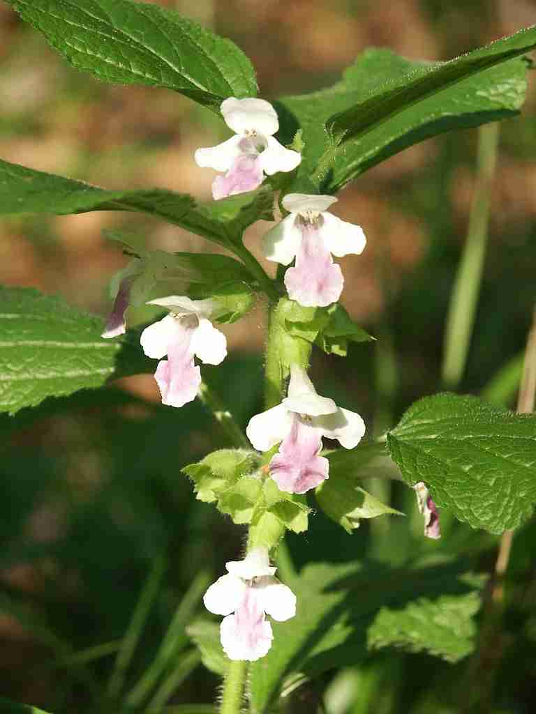
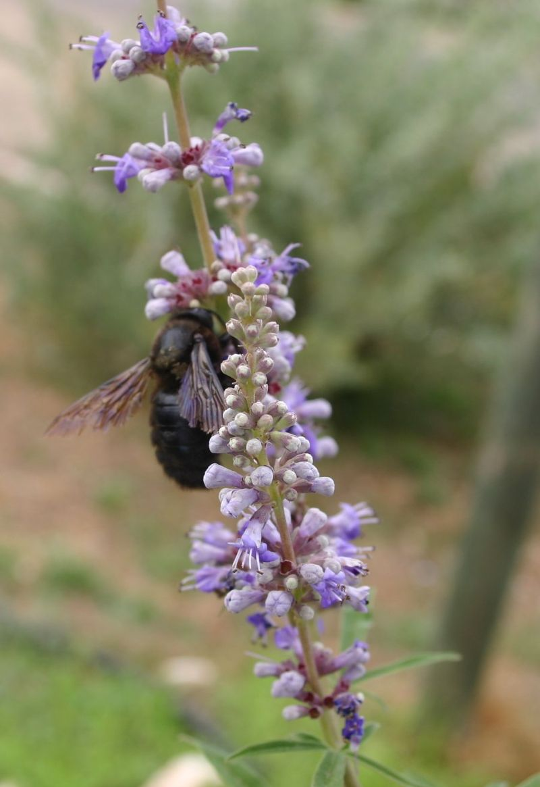
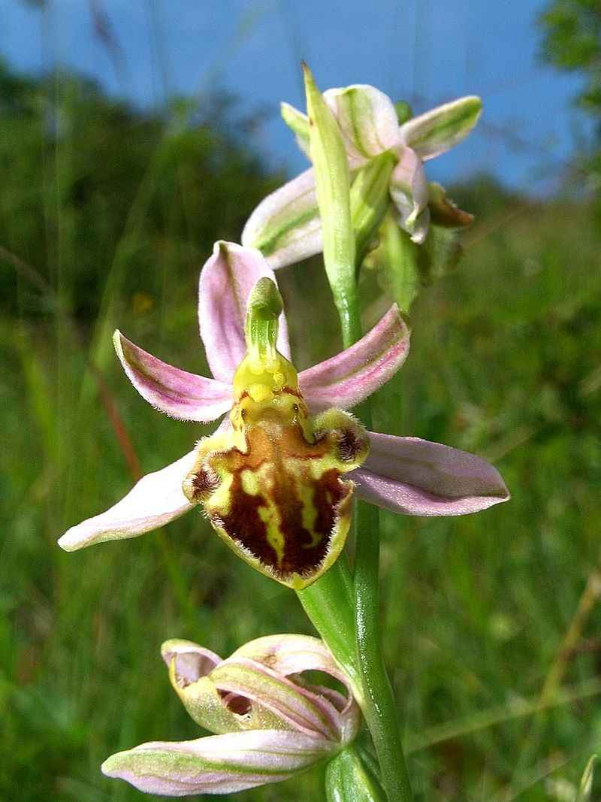

# MicroGeoLifeCLEF example

This example serves as a Getting Started code.
It uses the MicroGeoLifeCLEF 2022 dataset which can be downloaded separately [here](https://lab.plantnet.org/seafile/f/b07039ce11f44072a548/?dl=1) (the code downloads it automatically if it was not downloaded before).
It consists of a subset of 10,000 observations from the GeoLifeCLEF 2022 dataset, retaining 1,000 observations in France of the 10 species most present in the original dataset belonging to two families (_Lamiaceae_ and _Orchidaceae_):

<div style="text-align: center;">
  <h2>Lamiaceae</h2>
</div>

| Himantoglossum robertianum | Melittis melissophyllum | Orchis mascula | Perovskia atriplicifolia (Salvia yangii) | Vitex agnus-castus |
|:-:|:-:|:-:|:-:|:-:|
 |  |  |  |  |
[Wikipedia: Mentha suaveolens](https://en.wikipedia.org/wiki/Mentha_suaveolens) | [Wikipedia: Melittis](https://en.wikipedia.org/wiki/Melittis) | [Wikipedia: Stachys byzantina](https://en.wikipedia.org/wiki/Stachys_byzantina) | [Wikipedia: Salvia yangii](https://en.wikipedia.org/wiki/Salvia_yangii) | [Wikipedia: Vitex agnus-castus](https://en.wikipedia.org/wiki/Vitex_agnus-castus) | 

<div style="text-align: center;">
  <h2>Orchidaceae</h2>
</div>

| Himantoglossum hircinum | Mentha suaveolens | Ophrys apifera | Orchis purpurea | Stachys byzantina |
|:-:|:-:|:-:|:-:|:-:|
 | | | | |
[Wikipedia: Himantoglossum hircinum](https://en.wikipedia.org/wiki/Himantoglossum_hircinum) |[Wikipedia: Himantoglossum robertianum](https://en.wikipedia.org/wiki/Himantoglossum_robertianum) |[Wikipedia: Orchis mascula](https://en.wikipedia.org/wiki/Orchis_mascula) |[Wikipedia: Ophrys apifera](https://en.wikipedia.org/wiki/Ophrys_apifera) |[Wikipedia: Orchis purpurea](https://en.wikipedia.org/wiki/Orchis_purpurea) |


## Running the examples

To run the example `cnn_on_rgb_patches.py` on a single GPU using the `<DATASET_PATH>` as path to the dataset (will be downloaded automatically), use:
```script
python cnn_on_rgb_patches.py data.dataset_path=<DATASET_PATH> trainer.gpus=1
```

Similarly for the example `cnn_on_rgb_nir_patches.py`:
```script
python cnn_on_rgb_nir_patches.py data.dataset_path=<DATASET_PATH> trainer.gpus=1
```
### Inference

Switch running mode from training to prediction by setting the config file parameter `inference.predict` to `true` and specify a path to your model checkpoint. Both training and prediciton mode are embedded in the example file.

## Parametrization

You can parametrize your models and your training routine through your `.yaml` config file which is split in 5 main sections :

- **trainer** : contains parameters to tweak your training session via pytorchlightning Trainer class
- **model** : defines which model you want to load, from which source, and contains models hyperparameters. You can pass any model hyperparameter listed in your provider's model builder.
- **optimizer** : contains your optimizer's hyperparameters.
- **data** : contains data related information such as the path to your dataset and batch size.

## Additional notes
### Transfert learning
Be aware that for now there are now tools provided to easily freeze or manage layers during training. Thus you may encounter errors when trying to train a model with pre-trained weights _(e.g. from ImageNet)_ on RGB-IR data as most of pre-trained models are done over 3 RGB images.

To avoid such issue, either :
- train from scratch by setting hyperparameter `model.model_kwargs.pretrained` to false
- manually change your model and freeze strategy before `trainer.fit` (in your main script) to only train 3 bands at once
- restrain your trainings to 3 bands and merge several trainings output features

Future updates will aim at making this step easier.

### Debugging
For debugging purposes, using the `trainer.fast_dev_run=true` and `hydra.job.name=test` parameters can be handy:
```script
python cnn_on_rgb_patches.py data.dataset_path=<DATASET_PATH> trainer.gpus=1 +trainer.fast_dev_run=true +hydra.job.name=test
```

Be careful when using any path argument like `data.dataset_path`, since each `.yaml` file contains a `hydra.run.dir` argument set with a default value of `outputs/<hydra job name>/<date>` (with `<hydra job name>` itself defaulting to the name of the file executed), the current working directory will be changed to said path once the config file is read and loaded. Therefore any other path argument should be written relatively to that `hydra.run.dir` path.
