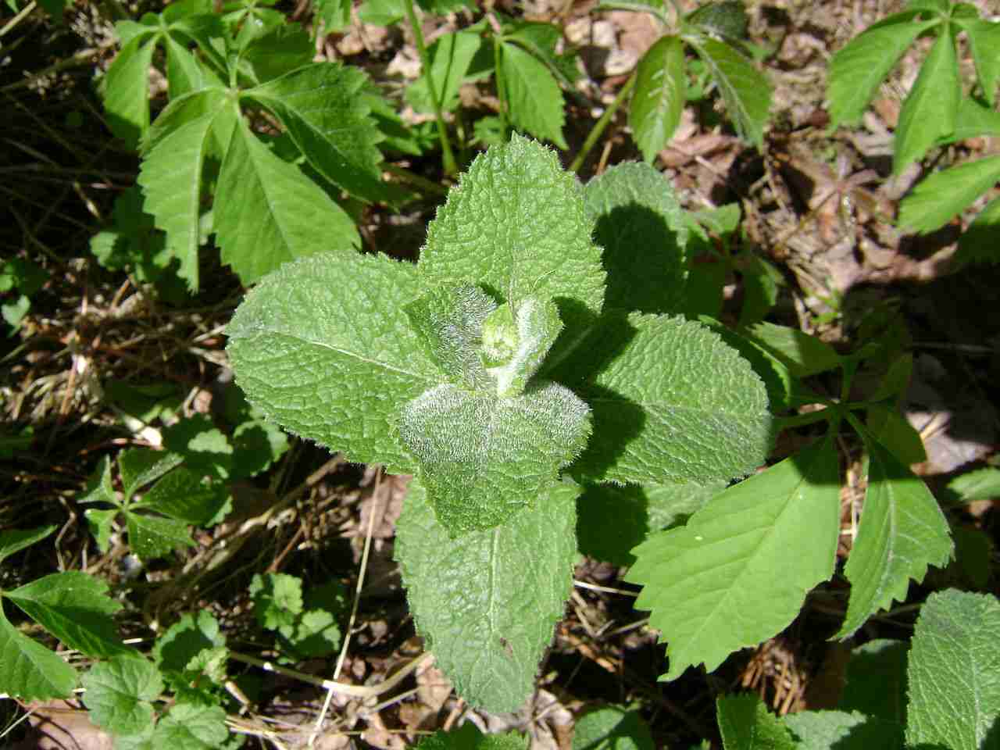

# Sentinel-2 Raster (using torchgeo) example

This example serves as a Getting Started code with our `torchgeo` based pipeline.
It uses the Sentinel-2A data which can be downloaded separately from [Microsoft Planetary Computer](https://planetarycomputer.microsoft.com/dataset/sentinel-2-l2a) consisting of multi-spectral raster files (.tif) of the planet taken from the Sentinel-2 program, spanning from 2016 to nowadays. By default, sample data is downloaded from MPC, consisting of one 4-bands (RGB-IR) tile over Montpellier, France.

This visual data is coupled with an observation file containing plant references observed at different geographical locations. The observation file is an extract from the Pl@ntNet observation database where cell values might not always correspond to the right species since this is a dummie file.
Species include:

| Himantoglossum hircinum | Mentha suaveolens | Ophrys apifera | Orchis purpurea | Stachys byzantina |
|:-:|:-:|:-:|:-:|:-:|
 |  |  |  |  |


## Running the examples

To run the example `cnn_on_rgbnir_torchgeo.py` on a single GPU using the `<DATASET_PATH>` as path to the dataset (will be downloaded automatically), use:
```script
python cnn_on_rgbnir_torchgeo.py data.dataset_path=<DATASET_PATH> trainer.gpus=1
```
### Parametrization

All hyperparameters are specified in a `.yaml` configuration file located in the `config/` directory, which is read and transformed into a dictionary by **Hydra** when running your scripts.

You can parametrize your models and your training routine through your `.yaml` config file which is split in 5 main sections :

- **trainer** : contains parameters to tweak your training session via pytorchlightning Trainer class
- **model** : defines which model you want to load, from which source, and contains models hyperparameters. You can pass any model hyperparameter listed in your provider's model builder.
- **optimizer** : contains your optimizer's and metrics hyperparameters.
  - **metrics** keys name must match existing **TorchMetrics** metrics and contain the following sub key-value pairs:
    1. `callable` key with a functional metric method as value (unless the callable is listed in the FMETRICS_CALLABLES constant dictionary at the start of your main script, in which case this argument is optional)
    2. `kwargs` key with the functional metric method's input arguments
- **data** : contains data related information such as the path to your dataset and batch size.
- **task** : defines the type of deep learning task chosen for your experiment (currently only supporting any of `['classification_binary', 'classification_multiclass', 'classification_multilabel']`)

Key-value pairs from **data** and **task** are passed as input arguments of your data module _(e.g. `Sentinel2TorchGeoDataModule`)_.\
Key-value pairs from **model**, **optimizer** and **task** are passed as input arguments of your prediction system _(e.g. `ClassificationSystem`)_.
Key-value pairs from **trainer** are passed as input arguments of your pytorchlightning trainer.\
Key-value pairs from **inference** are passed as input arguments of your pytorchlightning checkpoint loading method.

Note that any of these parameters can also be passed through command line like shown in the previous section and overrule those of the config file.

### Inference

Switch running mode from training to prediction by setting the config file parameter `inference.predict` to `true` and specify a path to your model checkpoint. Both training and prediciton mode are embedded in the example file.

## Additional notes
### Debugging

For debugging purposes, using the `trainer.fast_dev_run=true` and `hydra.job.name=test` parameters can be handy:
```script
python cnn_on_rgb_patches.py data.dataset_path=<DATASET_PATH> trainer.gpus=1 +trainer.fast_dev_run=true +hydra.job.name=test
```

Be careful when using any path argument like `data.dataset_path`, since each `.yaml` file contains a `hydra.run.dir` argument set with a default value of `outputs/<hydra job name>/<date>` (with `<hydra job name>` itself defaulting to the name of the file executed), the current working directory will be changed to said path once the config file is read and loaded. Therefore any other path argument should be written relatively to that `hydra.run.dir` path.
